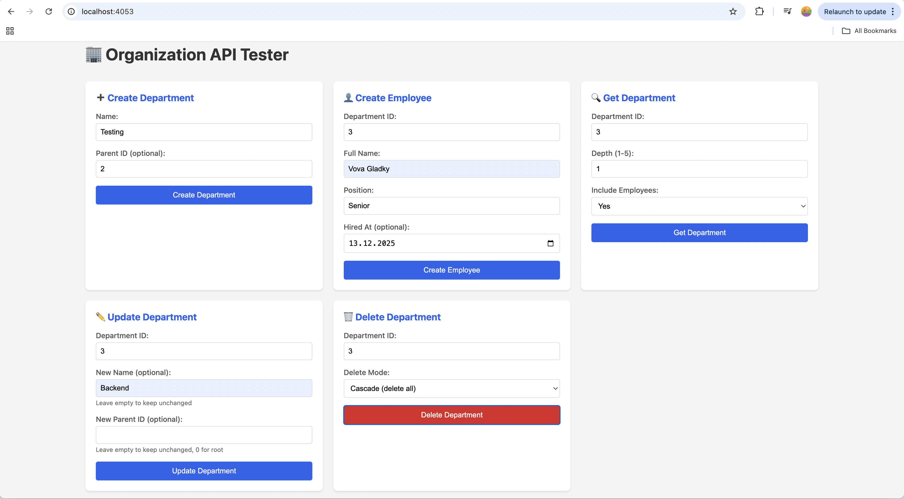

# TestHitalent2
## О проекте
REST-сервис для управления организационной структурой компании (отделы и сотрудники).

Проект включает простой веб-интерфейс для тестирования API, доступный по адресу `http://localhost:4053/`


### 🌐 Доступные API эндпоинты

| Метод | Путь | Описание |
| :--- | :--- | :--- |
| POST | /api/v1/departments | Создание отдела |
| GET | /api/v1/departments/{id} | Получение отдела с возможностью загрузки дочерних отделов и сотрудников |
| PATCH | /api/v1/departments/{id} | Обновление отдела (название и/или родительский отдел) |
| DELETE | /api/v1/departments/{id} | Удаление отдела (cascade или reassign режимы) |
| POST | /api/v1/departments/{id}/employees | Создание сотрудника в отделе |

## 🗄️ База данных

В качестве базы данных используется **PostgreSQL**.

### 🛠️ Миграции

Для создания и управления схемой базы данных применяются миграции с помощью **goose**, которые находятся в папке [`migrations/`](./migrations).

Миграции запускаются **автоматически** при старте приложения.

### 🗃️ Структура базы данных

В базе данных предусмотрены две таблицы:

#### Таблица `departments`:

| Поле | Тип | Описание |
| :--- | :--- | :--- |
| id | SERIAL | Уникальный идентификатор отдела (auto increment) |
| name | VARCHAR(255) | Название отдела |
| parent_id | INT | Идентификатор родительского отдела (foreign key, nullable) |
| created_at | TIMESTAMP | Дата создания отдела |

#### Таблица `employees`:

| Поле | Тип | Описание |
| :--- | :--- | :--- |
| id | SERIAL | Уникальный идентификатор сотрудника (auto increment) |
| department_id | INT | Идентификатор отдела (foreign key) |
| full_name | VARCHAR(255) | ФИО сотрудника |
| position | VARCHAR(255) | Должность сотрудника |
| hired_at | TIMESTAMP | Дата приёма на работу (nullable) |
| created_at | TIMESTAMP | Дата создания записи |

**Важно:**
- Отделы образуют **иерархическую структуру** (дерево) через `parent_id`
- При удалении отдела можно выбрать режим:
  - **cascade** - удалить отдел со всеми дочерними отделами и сотрудниками
  - **reassign** - переназначить дочерние отделы и сотрудников в другой отдел
- При удалении отдела в режиме cascade все связанные сотрудники удаляются автоматически

## Технологии и библиотеки
Проект написан на языке **Go** и использует следующие библиотеки и инструменты:

#### Язык программирования:
- **Go** (версия 1.22+)

## 📚 Используемые библиотеки

В проекте используются следующие ключевые Go-библиотеки:

### 🔑 Основные утилиты
| Библиотека | Назначение | Документация |
|------------|------------|--------------|
| `net/http` | Стандартная библиотека для HTTP-сервера с поддержкой method-specific routing (Go 1.22+) | [ссылка](https://pkg.go.dev/net/http) |
| `github.com/ilyakaznacheev/cleanenv` | Чтение и валидация конфигурации из окружения и файлов | [ссылка](https://github.com/ilyakaznacheev/cleanenv) |

### 🗃️ Работа с данными
| Библиотека | Назначение | Документация |
|------------|------------|--------------|
| `github.com/pressly/goose/v3` | Управление миграциями базы данных (создание, применение, откат) | [ссылка](https://github.com/pressly/goose) |
| `gorm.io/gorm` | ORM для работы с PostgreSQL | [ссылка](https://gorm.io) |
| `gorm.io/driver/postgres` | Драйвер PostgreSQL для GORM | [ссылка](https://gorm.io/docs/connecting_to_the_database.html) |
| `github.com/jackc/pgx/v5` | Высокопроизводительный драйвер PostgreSQL | [ссылка](https://github.com/jackc/pgx) |

### 📝 Логирование
| Библиотека | Назначение | Документация |
|------------|------------|--------------|
| `go.uber.org/zap` | Быстрое структурированное логирование с минимальным оверхедом | [ссылка](https://go.uber.org/zap) |

### 🧪 Тестирование
| Библиотека | Назначение | Документация |
|------------|------------|--------------|
| `github.com/stretchr/testify` | Библиотека для assertions в тестах | [ссылка](https://github.com/stretchr/testify) |
| `go.uber.org/mock` | Генерация моков для unit-тестирования | [ссылка](https://github.com/uber-go/mock) |

## 📚 Структура проекта

```bash
├── cmd/
│   ├── main.go              # Основной исполняемый файл проекта
│   └── migrate/             # Утилита для ручного управления миграциями
├── config/                  # Конфигурационные файлы
│   ├── config.example.yaml  # Пример конфигурации
│   └── config.yaml          # Конфигурация приложения (host, port)
├── internal/                # Внутренняя бизнес-логика (не предназначена для внешнего использования)
│   ├── app/                 # Инициализация приложения
│   ├── config/              # Конфигурация приложения
│   ├── models/              # Модели данных (Department, Employee)
│   ├── repository/          # Слой взаимодействия с базой данных
│   │   └── mocks/           # Моки репозитория для тестирования
│   ├── service/             # Слой бизнес-логики с валидацией
│   │   ├── service_test.go  # Unit-тесты сервиса
│   │   └── mocks/           # Моки сервиса для тестирования
│   ├── suberrors/           # Кастомные ошибки приложения
│   └── transport/           # HTTP transport layer (handlers)
│       └── server_test.go   # Unit-тесты handlers
├── migrations/              # Скрипты миграций базы данных (goose)
├── pkg/                     # Публичные пакеты, доступные извне (reusable)
│   ├── logger/              # Пакет логирования (zap)
│   └── postgres/            # Пакет работы с базой данных PostgreSQL (GORM)
├── web/                     # Веб-интерфейс
│   └── templates/           # HTML шаблоны
│       └── index.html       # Простой UI для тестирования API
├── docker-compose.yml       # Docker Compose конфигурация
├── Dockerfile               # Dockerfile для сборки приложения
├── .env                     # Переменные окружения для Docker
└── env.example              # Пример переменных окружения
```

## 📚 Запуск проекта

Для запуска проекта необходимо выполнить следующие шаги:

```bash
git clone https://github.com/your-username/TestHitalent2.git
```

```bash
cd TestHitalent2
```

### Требования

- **Docker** и **Docker Compose** должны быть установлены
- Для разработки: **Go** версии 1.26
  - Ссылка для скачивания: [Go Download](https://go.dev/doc/install)

### Настройка конфигурации

Перед запуском проекта необходимо создать файлы конфигурации на основе примеров:

1. Создайте файл `.env` на основе `env.example`:

```bash
cp env.example .env
```

Содержимое `.env`:

```env
POSTGRES_USER=root
POSTGRES_PASSWORD=1234
POSTGRES_DB=postgres
POSTGRES_HOST=postgres  
POSTGRES_PORT=5432      
```

**Важно:**
- При запуске через Docker Compose используйте `POSTGRES_HOST=postgres` 
- При локальной разработке (без Docker) используйте `POSTGRES_HOST=localhost` и внешний порт 

2. Создайте файл `config/config.yaml` на основе `config/config.example.yaml`:

```bash
cp config/config.example.yaml config/config.yaml
```

Содержимое `config/config.yaml`:

```yaml
host: 0.0.0.0
port: 4053
```

**Примечание:** Вы можете изменить значения в этих файлах в соответствии с вашими требованиями.

### Запуск через Docker Compose

```bash
docker-compose up
```

Сервер будет доступен по адресу:
- API: `http://localhost:4053/api/v1`
- Web UI: `http://localhost:4053/`

Чтобы остановить сервер, выполните команду:

```bash
docker-compose down
```

### Ручное управление миграциями (опционально)

Миграции запускаются автоматически при старте приложения. Но для ручного управления можно использовать утилиту:

```bash
# Применить все миграции
go run cmd/migrate/main.go up

# Откатить последнюю миграцию
go run cmd/migrate/main.go down

# Откатить все миграции
go run cmd/migrate/main.go reset

# Проверить статус миграций
go run cmd/migrate/main.go status
```

## 🧪 Тестирование

Проект содержит **unit-тесты** для транспортного и сервисного слоя приложения.

### Запуск всех тестов:

```bash
go test ./...
```

### Запуск тестов конкретного пакета:

```bash
# Тесты service layer
go test ./internal/service

# Тесты transport layer
go test ./internal/transport
```

### Запуск тестов с покрытием:

```bash
# Service layer
go test -coverprofile=service_coverage.out ./internal/service
go tool cover -html=service_coverage.out

# Transport layer
go test -coverprofile=transport_coverage.out ./internal/transport
go tool cover -html=transport_coverage.out
```

### Генерация моков:

Моки генерируются автоматически с помощью `go:generate` директив:

```bash
go generate ./...
```

### Покрытие тестами:

- **Service Layer**: 88.9%
- **Transport Layer**: 73.0%

### Структура тестов:

- **Service Layer** (`internal/service/service_test.go`): Unit-тесты с моками репозитория
- **Transport Layer** (`internal/transport/server_test.go`): Unit-тесты HTTP handlers с моками сервиса
- Использование `httptest` для тестирования handlers без запуска реального сервера
- Использование `gomock` для создания моков

## 📋 Примеры использования API

### 1. Создание отдела

```bash
# Создание корневого отдела
curl -X POST -H "Content-Type: application/json" \
  -d '{"name":"Engineering"}' \
  http://localhost:4053/api/v1/departments

# Создание дочернего отдела
curl -X POST -H "Content-Type: application/json" \
  -d '{"name":"Backend Team","parent_id":1}' \
  http://localhost:4053/api/v1/departments
```

**Ответ:**

```json
{
  "id": 1,
  "name": "Engineering",
  "parent_id": null,
  "created_at": "2026-03-17T12:00:00Z"
}
```

### 2. Получение отдела

```bash
# Получить отдел без дочерних отделов и сотрудников
curl -X GET http://localhost:4053/api/v1/departments/1

# Получить отдел с дочерними отделами (глубина 1)
curl -X GET http://localhost:4053/api/v1/departments/1?depth=1

# Получить отдел с дочерними отделами (глубина 2) и сотрудниками
curl -X GET "http://localhost:4053/api/v1/departments/1?depth=2&include_employees=true"
```

**Параметры запроса:**
- `depth` (опционально) - глубина загрузки дочерних отделов (по умолчанию 0, максимум 10)
- `include_employees` (опционально) - загружать ли сотрудников (true/false, по умолчанию false)

**Ответ:**

```json
{
  "id": 1,
  "name": "Engineering",
  "parent_id": null,
  "created_at": "2026-03-17T12:00:00Z",
  "children": [
    {
      "id": 2,
      "name": "Backend Team",
      "parent_id": 1,
      "created_at": "2026-03-17T12:05:00Z",
      "children": []
    }
  ],
  "employees": [
    {
      "id": 1,
      "department_id": 1,
      "full_name": "John Doe",
      "position": "Engineering Manager",
      "hired_at": "2023-01-15T00:00:00Z",
      "created_at": "2026-03-17T12:10:00Z"
    }
  ]
}
```

### 3. Обновление отдела

```bash
# Изменить название отдела
curl -X PATCH -H "Content-Type: application/json" \
  -d '{"name":"Software Engineering"}' \
  http://localhost:4053/api/v1/departments/1

# Переместить отдел в другой родительский отдел
curl -X PATCH -H "Content-Type: application/json" \
  -d '{"parent_id":3}' \
  http://localhost:4053/api/v1/departments/2

# Изменить название и родительский отдел
curl -X PATCH -H "Content-Type: application/json" \
  -d '{"name":"Backend Development","parent_id":1}' \
  http://localhost:4053/api/v1/departments/2
```

**Ответ:**

```json
{
  "id": 1,
  "name": "Software Engineering",
  "parent_id": null,
  "created_at": "2026-03-17T12:00:00Z"
}
```

### 4. Создание сотрудника

```bash
curl -X POST -H "Content-Type: application/json" \
  -d '{
    "full_name": "John Doe",
    "position": "Software Engineer",
    "hired_at": "2023-01-15T00:00:00Z"
  }' \
  http://localhost:4053/api/v1/departments/1/employees
```

**Ответ:**

```json
{
  "id": 1,
  "department_id": 1,
  "full_name": "John Doe",
  "position": "Software Engineer",
  "hired_at": "2023-01-15T00:00:00Z",
  "created_at": "2026-03-17T12:10:00Z"
}
```

### 5. Удаление отдела

```bash
# Удалить отдел со всеми дочерними отделами и сотрудниками (cascade)
curl -X DELETE "http://localhost:4053/api/v1/departments/1?mode=cascade"

# Удалить отдел, переназначив дочерние отделы и сотрудников в другой отдел
curl -X DELETE "http://localhost:4053/api/v1/departments/1?mode=reassign&reassign_to_department_id=2"
```

**Параметры запроса:**
- `mode` (обязательно) - режим удаления: `cascade` или `reassign`
- `reassign_to_department_id` (обязательно для режима `reassign`) - ID отдела, в который переназначить дочерние отделы и сотрудников

**Ответ:** HTTP 204 No Content (пустое тело)

## 🔧 Конфигурация

Конфигурация приложения находится в файле `config/config.yaml`:

```yaml
host: 0.0.0.0  # Хост для привязки сервера
port: 4053     # Порт сервера
```

Настройки PostgreSQL задаются через переменные окружения в `.env`:

```env
POSTGRES_USER=root
POSTGRES_PASSWORD=1234
POSTGRES_DB=postgres
POSTGRES_HOST=postgres  # имя сервиса из docker-compose
POSTGRES_PORT=5432
```

## 🚨 Обработка ошибок

API возвращает ошибки в формате JSON с описанием:

```json
{
  "error": "Department not found"
}
```

или

```json
{
  "error": "Invalid request body",
  "description": "invalid character 'i' looking for beginning of value"
}
```

### HTTP коды ответов:

| Код | Описание |
|-----|----------|
| 200 OK | Успешное получение данных |
| 201 Created | Успешное создание ресурса |
| 204 No Content | Успешное удаление |
| 400 Bad Request | Невалидные данные в запросе |
| 404 Not Found | Ресурс не найден |
| 409 Conflict | Конфликт данных (например, дублирующееся имя, циклическая зависимость) |
| 500 Internal Server Error | Внутренняя ошибка сервера |

## 📝 Валидация данных

Валидация осуществляется на уровне сервиса с использованием кастомных проверок:

### Правила валидации для Department:
- `name`: обязательное поле, минимум 1 символ после обрезки пробелов, максимум 255 символов
- `parent_id`: должен существовать в базе данных (если указан)
- Название отдела должно быть уникальным в рамках родительского отдела
- Запрещено создание циклических зависимостей (отдел не может быть родителем для самого себя или своих предков)

### Правила валидации для Employee:
- `full_name`: обязательное поле, минимум 1 символ после обрезки пробелов, максимум 255 символов
- `position`: обязательное поле, минимум 1 символ после обрезки пробелов, максимум 255 символов
- `department_id`: должен существовать в базе данных
- `hired_at`: опциональное поле, формат RFC3339 (например, "2023-01-15T00:00:00Z")

### Правила валидации для query parameters:
- `depth`: должен быть числом от 0 до 10
- `include_employees`: должен быть "true" или "false"
- `mode`: должен быть "cascade" или "reassign"
- `reassign_to_department_id`: должен быть валидным положительным числом и существовать в базе
